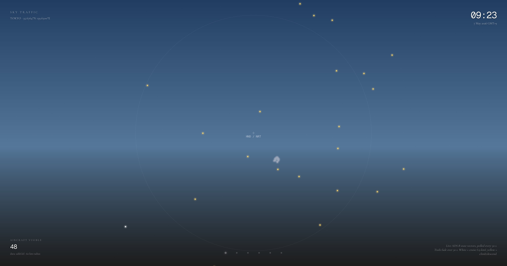
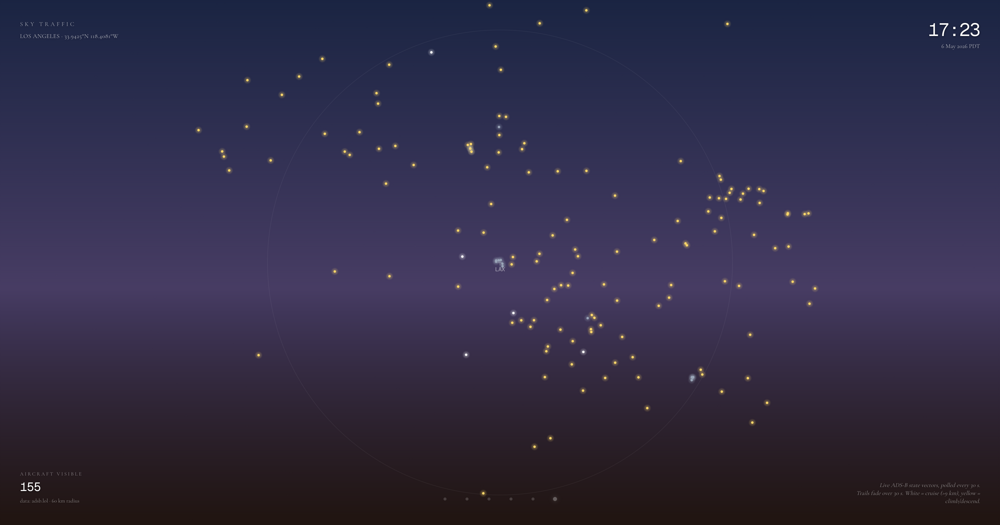
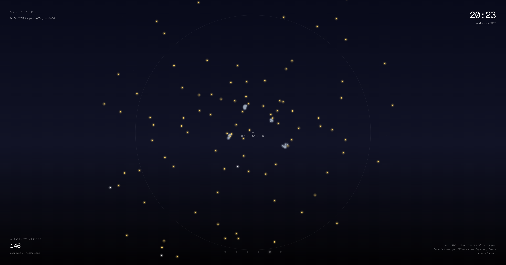

# Sky Traffic

Live aircraft over your city's airspace, drawn as Canvas trails. Sister piece to [Tide Pixels](https://github.com/Jada-Q/tide-pixels) — same minimal editorial layer, same single-canvas RAF loop, different live signal.

<p align="center">
  
  
  
</p>

<p align="center"><em>Same instant, three coastlines — Tokyo morning over HND/NRT · Los Angeles dusk over LAX · New York night over JFK/LGA/EWR. Yellow = climbing/descending, white = cruise, faint blue-grey clusters at airports = aircraft on the ground.</em></p>

**Live**: [sky-traffic-2026-05-07.vercel.app](https://sky-traffic-2026-05-07.vercel.app)

Open it in a browser tab, or set it as a Mac desktop wallpaper via [Plash](https://sindresorhus.com/plash) and watch real planes drift across your screen all day.

---

## Five cities

| City | URL |
|---|---|
| Tokyo (default) | [`/`](https://sky-traffic-2026-05-07.vercel.app/) |
| Osaka | [`/?c=osaka`](https://sky-traffic-2026-05-07.vercel.app/?c=osaka) |
| Shanghai 上海 | [`/?c=shanghai`](https://sky-traffic-2026-05-07.vercel.app/?c=shanghai) (see note) |
| New York | [`/?c=nyc`](https://sky-traffic-2026-05-07.vercel.app/?c=nyc) |
| Hong Kong | [`/?c=hkg`](https://sky-traffic-2026-05-07.vercel.app/?c=hkg) |
| Los Angeles | [`/?c=lax`](https://sky-traffic-2026-05-07.vercel.app/?c=lax) |

Custom point: `/?lat=37.62&lng=-122.38&label=SFO&tz=America/Los_Angeles&radius=60`

**Hide ground traffic**: append `&ground=hide` to any URL. Aircraft on the ground (taxiing, parked, holding) normally show as muted blue-grey dots clustered around the airport. `ground=hide` filters them out so only airborne traffic renders — useful if the ground cluster feels crowded. The visible-aircraft count updates to match.

The bottom dot row (right side on mobile) lets you switch between cities live.

### Note on China mainland coverage

ADS-B aggregators (adsb.lol, OpenSky, FlightRadar24) depend on community-volunteer "feeders" running antennas. Mainland China has very few public feeders, so the live data layer is **largely empty over Shanghai, Beijing, Guangzhou, Chengdu, etc.** The Shanghai preset is included on purpose — international flights crossing overhead occasionally appear, and the empty bowl itself is honest signal about how distributed open data ecosystems work. The UI shows a muted hint when the bowl reads zero. Hong Kong, just outside that gap, has ample feeder coverage and works normally.

### Plane colors

- **white** — cruise (baro altitude > 9 km)
- **yellow** — climbing or descending (typical for traffic near airports)
- **muted blue-grey** — on the ground (taxi / parked / holding short)

---

## What's actually computed

- **Aircraft positions** — pulled every 30 s from a server-side proxy at `/api/states`. The proxy talks to [api.adsb.lol](https://api.adsb.lol) (community-run ADS-B aggregator) and translates the response back into the OpenSky Network state-vector shape, so the client parser is independent of the upstream provider.
- **Trails** — each plane's last 30 s of positions are kept in memory, drawn as a polyline with exponentially fading alpha (`exp(-3 · age/30s)`). Points older than 30 s are pruned; planes not seen for 60 s are dropped.
- **Plane color by altitude** — cruise (>9 km baro altitude) is white; climb / descend / lower altitudes are warm yellow; on-ground is muted blue-grey. A small radial glow under each dot.
- **Sky color** — vertical gradient interpolated across 10 keyframes through the day (deep night → dawn → noon → dusk → night), in the city's local timezone. A warm horizon glow band fades in around dawn / dusk.
- **Local Mercator projection** — centered on the chosen airport, scaled so the configured radius (50–70 km depending on city) fits the canvas with padding. A faint ring marks the radius; a 10 px crosshair marks the airport.
- **Film grain** — sparse RGB noise per frame, just enough to break up the gradient.

There is **no interactivity** by design — no hover, no click, no settings UI. Plash's "Browsing Mode" is off by default and that's exactly what the piece expects.

### Why not OpenSky directly?

This was the plan, but `opensky-network.org/api/states/all` blocks (returns `UND_ERR_CONNECT_TIMEOUT`) from every Vercel egress region tested (`iad1`, `fra1`). Anonymous access from cloud IPs appears policy-gated. adsb.lol is a community-run aggregator built on the same raw ADS-B feeders OpenSky uses — same data, no IP block. If you self-host and want to switch back, the parser shape in `app/api/states/route.ts` is OpenSky-compatible and there's a single fetch URL to swap.

---

## Tech stack

- Next.js 16 (App Router, server components for `searchParams`)
- Tailwind v4
- Cormorant Garamond + Geist Mono (`next/font/google`)
- Plain Canvas 2D + RAF — no animation library
- Live data: [api.adsb.lol](https://api.adsb.lol), proxied through a Next.js Route Handler with 25 s in-memory cache + stale-on-error fallback

---

## Local dev

```bash
pnpm install
pnpm dev
```

Open <http://localhost:3000>.

```bash
pnpm build  # production build
```

---

## Used as a desktop wallpaper

1. Install [Plash](https://apps.apple.com/app/plash/id1494023538) (free, Mac App Store).
2. Plash menu bar → `Add Website…` → paste a city URL above.
3. Keep `Browsing Mode` off — Sky Traffic has no required interaction; switching cities happens via Plash's website list (one entry per city).

For multi-display: assign different cities per monitor (Tokyo on one, NYC on another) — the difference in airspace density across timezones makes the screen feel alive.

---

## License

MIT — do whatever you want, but if you ship a paid product literally cloned from this, at least drop a thank-you somewhere.
